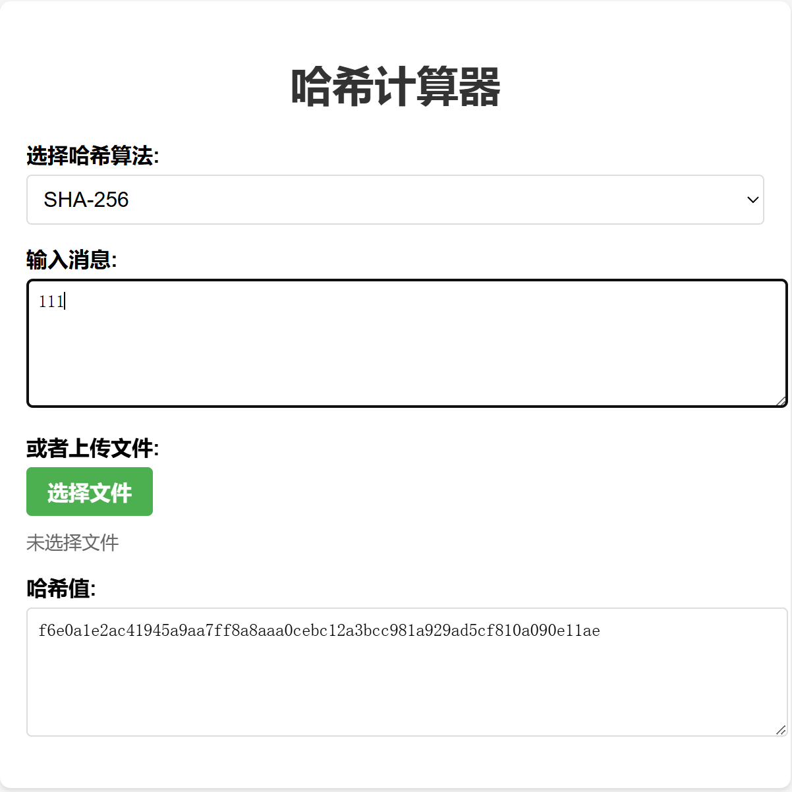

# 哈希计算器

一个简单而功能强大的在线哈希计算工具，支持多种哈希算法和文件上传。

# 界面截图

## 功能特性

- 支持多种哈希算法：
  - SHA-1
  - SHA-256
  - SHA-384
  - SHA-512
  - MD5
  - SHA3-256
  - SHA3-512
  - SM3（国密算法）

- 支持两种输入方式：
  - 文本输入
  - 文件上传

- 实时计算：输入变化时自动更新哈希值
- 支持大文件处理
- 纯浏览器端计算，数据不会上传到服务器

## 技术实现

- 使用原生 JavaScript 和 Web Crypto API
- 使用 CryptoJS 库支持额外的哈希算法
- 使用 js-sha3 库实现 SHA3 系列算法
- 使用 sm-crypto 库实现 SM3 国密算法

## 使用方法

1. 直接打开 index.html 文件在浏览器中运行
2. 选择需要使用的哈希算法
3. 输入文本或上传文件
4. 哈希值将自动计算并显示在结果框中

## 注意事项

- 文件处理采用分块读取方式，支持较大文件的处理
- 建议使用现代浏览器以获得最佳性能
- Web Crypto API 需要在支持 HTTPS 或本地环境下使用

## 开源协议

MIT License
